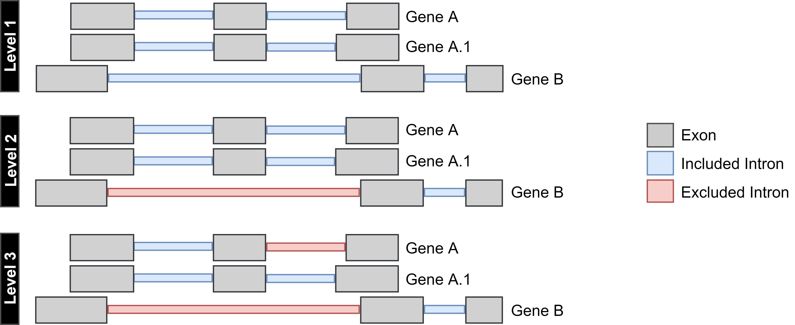

#Overlap of genomic elements

SPLICE-q is sensitive to the overlap of genomic elements. 
This means the tool takes into consideration when a genome shows overlapping features that 
can cause issues with a correct assignment of reads to specific introns or exons. For example, for introns overlapping exons of other genes.
This is problematic due to the RNA-seq methodology’s limitation that makes it difficult to confidently 
determine without ambiguity to which genomic element, exon or intron, these reads should be attributed to.

Therefore, SPLICE-q allows the user to select different levels of restrictiveness for **strand-specific** filtering. They are: 
<br />
- **Level 1**: keeps all introns in the genome regardless of overlaps with other genomic elements.<br />
- **Level 2**: selects only introns whose splice junctions do not overlap any exon of a different gene. <br />
- **Level 3**: selects only introns that do not overlap with any exon of the same or a different gene.  _This is the default option._



If you wish to select levels 1 or 2 for your analysis, you simply have to adjust the parameter
`--FilterLevel` or `-f`. For example:

```bash
$ SPLICE-q -b file.bam -g annotation.gtf -f 2
```

This will run SPLICE-q on **Level 2**.